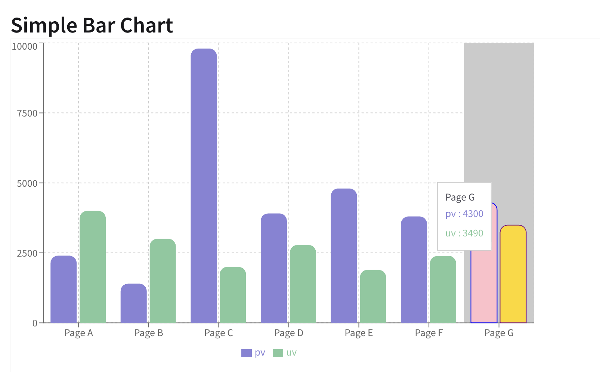

# Tutorial Creation
## Update of Blog for Assignment 2.6

I had to create a tutorial for adding a component/library to work in a React project. 
This was for my retake of the WDV229 Course (Because :chipmunk:s are evil.)

The objectives for this tutorial were: 

* Successfully research an existing library.
* Implement libraries into your own code.
* Explain how to use the library to other developers. 

For the tutorial, I picked [Recharts](https://recharts.github.io/). It provides an enormous selection of graphs
that users can integrate in their project. 

